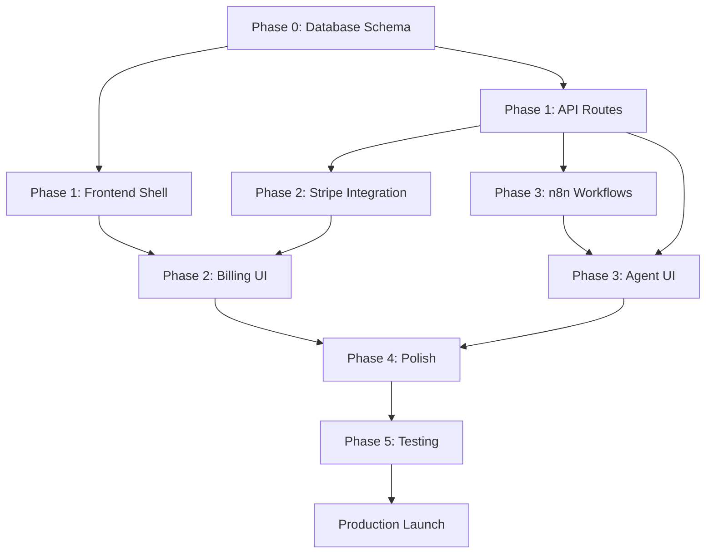

# GEO Platform - Technical Execution Plan
## Master Implementation Strategy

**Project Type:** Augmenting Existing Next.js SaaS Platform  
**Timeline:** 2 Weeks (14 Days)  
**Approach:** Parallel Team Coordination  
**Status:** Planning → Ready for Execution

---

## Executive Summary

### Current State Analysis

**What Exists:**
- ✅ Next.js 16 + React 19 foundation (`saas-platform/` directory)
- ✅ Supabase auth (client, server, middleware)
- ✅ Auth UI (login, signup, password reset)
- ✅ Protected route structure with middleware
- ✅ Dashboard shell (reads from DB but incomplete)
- ✅ Onboarding page scaffold
- ✅ Partial database migrations (5 tables with RLS)
- ✅ Comprehensive PRD documentation (`PRD_Structure/`)

**What's Missing:**
- ❌ All API routes (`/api/*` completely absent)
- ❌ Complete database schema (7+ tables missing)
- ❌ Stripe integration (checkout, webhooks, customer portal)
- ❌ n8n workflow integration
- ❌ Dashboard sub-pages (queries, content, recommendations, settings, credits)
- ❌ React Query + Zustand state management
- ❌ Shadcn UI components
- ❌ All AI agent implementations
- ❌ Credit system and billing logic
- ❌ Recommendations engine

### Build vs Buy vs Augment

| Component | Decision | Rationale |
|-----------|----------|-----------|
| **Frontend Shell** | Augment | Next.js app exists, needs feature pages |
| **Auth System** | Keep | Supabase auth working, just needs completion |
| **API Layer** | Build | No routes exist, clean slate |
| **Database** | Augment | Migrations partial, need 7+ more tables |
| **AI Workflows** | Build | n8n integration from scratch |
| **Billing** | Build | Stripe setup needed entirely |

---

## Team Structure (Parallel Execution)

### Team A: Infrastructure & Backend
**Lead Agent:** `backend-specialist`  
**Supporting:** `database-architect`, `security-auditor`

**Responsibilities:**
- Database migrations (complete schema)
- API routes (all endpoints)
- Supabase integration (functions, triggers, RLS)
- n8n workflow setup and testing
- Backend utilities and helpers

**Priority:** P0 (blocks all other teams)

---

### Team B: Frontend & Dashboard
**Lead Agent:** `frontend-specialist`  
**Supporting:** `product-manager`

**Responsibilities:**
- Dashboard sub-pages (queries, content, recommendations, settings, credits)
- React Query + Zustand setup
- Shadcn UI integration
- Component library expansion
- State management and data fetching patterns

**Priority:** P1 (can start after basic API routes exist)

---

### Team C: Payments & Credits
**Lead Agent:** `backend-specialist`  
**Supporting:** `security-auditor`

**Responsibilities:**
- Stripe product/price setup
- Checkout flow implementation
- Webhook handlers (all subscription events)
- Credit system logic
- Customer portal integration

**Priority:** P1 (parallel with Team B after database ready)

---

### Team D: AI Agents & Automation
**Lead Agent:** Backend specialist working with n8n  
**Supporting:** All agents for prompt engineering

**Responsibilities:**
- n8n workflow creation (7 workflows)
- LLM API integration (OpenAI, Anthropic, Perplexity, Gemini)
- Agent implementations (Content Writer, Competitor Research, Query Researcher)
- Scheduled automation (ranking updates, recommendations)
- Error handling and retry logic

**Priority:** P2 (starts Day 8, requires API routes and database)

---

### Team E: Testing & Verification
**Lead Agent:** `test-engineer`  
**Supporting:** `qa-automation-engineer`

**Responsibilities:**
- E2E test suites (auth, dashboard, agents, billing)
- Unit tests for critical functions
- API integration tests
- Security scanning
- Performance testing
- Final verification before launch

**Priority:** P3 (continuous throughout, formal verification Days 12-14)

---

## Development Phases

### Phase 0: Foundation (Days 1-2)
**Goal:** Complete infrastructure setup, database fully operational

**Deliverables:**
- [ ] Complete Supabase schema (all 12 tables)
- [ ] All database functions and triggers
- [ ] RLS policies for all tables
- [ ] Environment variables configured
- [ ] n8n Cloud account setup
- [ ] Stripe account configured

**Blockers Removed:**
- Teams B, C, D can proceed once Phase 0 complete

---

### Phase 1: Core Backend (Days 3-5)
**Goal:** API layer functional, basic dashboard data flows working

**Team A (Backend):**
- [ ] API routes: `/api/dashboard/*` (6 endpoints)
- [ ] API routes: `/api/queries/*` (4 endpoints)
- [ ] API routes: `/api/credits/*` (2 endpoints)
- [ ] Onboarding trigger endpoint
- [ ] Initial Analysis workflow (n8n)

**Team B (Frontend):**
- [ ] React Query setup and providers
- [ ] Zustand store structure
- [ ] Shadcn UI installation and configuration
- [ ] Dashboard metrics display (cards, charts)
- [ ] Query management UI

**Milestone:** User can sign up, add queries, see placeholder rankings

---

### Phase 2: Billing & Credits (Days 6-7)
**Goal:** Subscription system operational, credits working

**Team C (Payments):**
- [ ] Stripe products/prices created
- [ ] Checkout session API
- [ ] Webhook handler implementation
- [ ] Customer portal integration
- [ ] Credit allocation/deduction logic

**Team B (Frontend):**
- [ ] Pricing page
- [ ] Credits widget in header
- [ ] Subscription management UI
- [ ] Billing settings page

**Milestone:** User can subscribe, receive credits, see balance

---

### Phase 3: AI Agents (Days 8-10)
**Goal:** All 3 agents operational, recommendations generating

**Team D (AI Agents):**
- [ ] Content Writer Agent (n8n workflow)
- [ ] Competitor Research Agent (n8n workflow)
- [ ] Query Researcher Agent (n8n workflow)
- [ ] Recommendation Generator (n8n workflow)
- [ ] Scheduled Ranking Update (n8n workflow)

**Team B (Frontend):**
- [ ] Agent execution modals (3 modals)
- [ ] Content history page
- [ ] Recommendations page
- [ ] Loading states and progress tracking

**Team A (Backend):**
- [ ] API routes: `/api/agents/*` (3 endpoints)
- [ ] API routes: `/api/recommendations/*` (2 endpoints)
- [ ] API routes: `/api/content/*` (2 endpoints)

**Milestone:** User can execute agents, generate content, see recommendations

---

### Phase 4: Polish & Integration (Days 11-12)
**Goal:** Complete feature set, smooth UX, error handling

**All Teams:**
- [ ] Competitor comparison complete
- [ ] Settings page complete
- [ ] Email templates (Supabase)
- [ ] Error boundaries and fallbacks
- [ ] Loading states everywhere
- [ ] Empty states with CTAs
- [ ] Mobile responsiveness
- [ ] Accessibility audit

**Milestone:** MVP feature-complete

---

### Phase 5: Testing & Launch Prep (Days 13-14)
**Goal:** Production-ready, verified, documented

**Team E (Testing):**
- [ ] E2E test suite passes
- [ ] Security scan clean
- [ ] Performance benchmarks met
- [ ] Cross-browser testing
- [ ] Mobile device testing

**All Teams:**
- [ ] Documentation complete
- [ ] Environment variables documented
- [ ] Deployment checklist verified
- [ ] Monitoring setup
- [ ] Error tracking configured

**Milestone:** Production deployment ready

---

## Dependency Graph

---

## Risk Management

### High-Risk Areas

| Risk | Impact | Mitigation | Owner |
|------|--------|------------|-------|
| **LLM API Rate Limits** | Blocks onboarding flow | Implement exponential backoff, queue system | Team D |
| **Stripe Webhook Reliability** | Credit allocation fails | Idempotency keys, retry logic, manual reconciliation | Team C |
| **Database Schema Changes** | Breaking changes mid-build | Lock schema Day 2, migrations only | Team A |
| **n8n Workflow Complexity** | Debugging difficult | Extensive logging, test webhooks, staging env | Team D |
| **Parallel Team Conflicts** | Git merge conflicts | Clear file ownership, PRs by feature | All |

### Medium-Risk Areas

| Risk | Impact | Mitigation |
|------|--------|------------|
| Agent prompt quality | Poor content generation | Pilot testing, iteration cycles |
| Mobile responsiveness | Poor UX on mobile | Responsive testing throughout |
| Credit calculation errors | Financial impact | Thorough unit tests, audit logs |

---

## Communication Protocol

### Daily Standups (Async)
**Format:** Each team posts update in shared doc
- ✅ Completed yesterday
- 🚧 Working on today
- 🚨 Blockers

### Integration Points
**When teams need to coordinate:**

| Scenario | Protocol |
|----------|----------|
| API contract changes | Team A notifies Team B, update types |
| Database schema changes | Team A updates migrations, notifies all |
| New UI components | Team B creates, documents in Storybook |
| Webhook testing | Team C provides test events to Team B |

---

## Success Metrics

### Technical Metrics
- [ ] Build time < 60 seconds
- [ ] Lighthouse score > 90
- [ ] API response time < 200ms (p95)
- [ ] Zero critical security issues (Semgrep, npm audit)
- [ ] Test coverage > 80% for critical paths

### Feature Completeness
- [ ] All P0 features from PRD implemented
- [ ] All API routes responding correctly
- [ ] All database migrations applied
- [ ] All n8n workflows active
- [ ] All Stripe webhooks handled

### User Experience
- [ ] Onboarding < 2 minutes
- [ ] Dashboard loads < 2 seconds
- [ ] Agent execution completes < 5 minutes
- [ ] Mobile responsive (all breakpoints)
- [ ] Accessibility (WCAG AA)

---

## Next Steps

### Immediate Actions (Today)
1. **Read IMPLEMENTATION_TASKS.md** - Get detailed task breakdown
2. **Read AGENT_ASSIGNMENTS.md** - Understand agent roles
3. **Review PRD_Structure/** - Reference for implementation details
4. **Set up development environment** - Supabase, Stripe, n8n accounts

### Team Kickoff (Day 1 Morning)
1. Team A: Start database migrations
2. Team B: Setup React Query + Zustand
3. Team C: Create Stripe products
4. Team D: Setup n8n workspace
5. Team E: Setup testing infrastructure

---

## Related Documents

- **IMPLEMENTATION_TASKS.md** - Granular task list with INPUT→OUTPUT→VERIFY
- **AGENT_ASSIGNMENTS.md** - Agent responsibilities and coordination matrix
- **VERIFICATION_CHECKLIST.md** - Quality gates and testing requirements
- **PRD_Structure/** - Complete product specifications
- **CLAUDE.md** - Architecture and project guidelines

---

**Plan Created:** February 14, 2026  
**Last Updated:** February 14, 2026  
**Status:** ✅ Ready for Execution  
**Next Review:** End of Phase 0 (Day 2)
